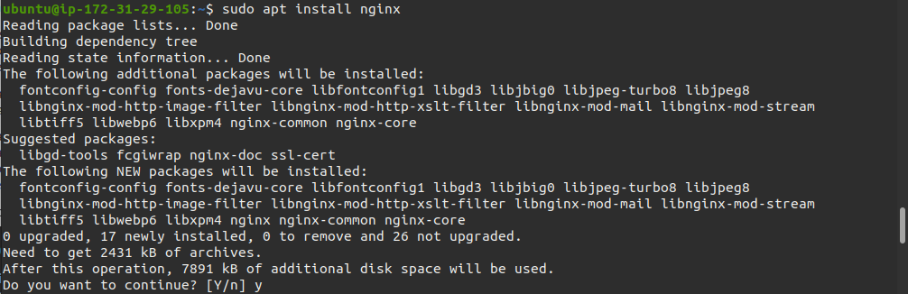
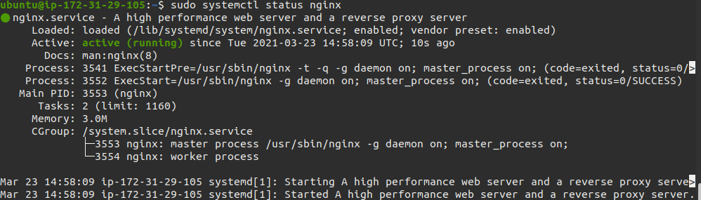
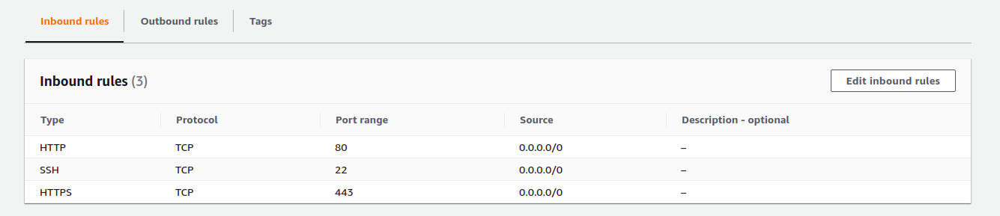
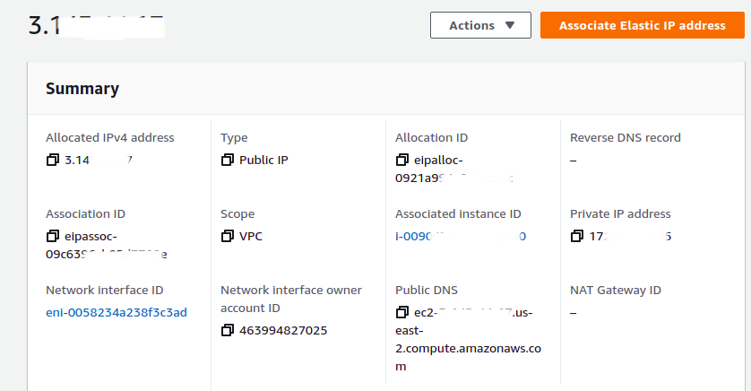
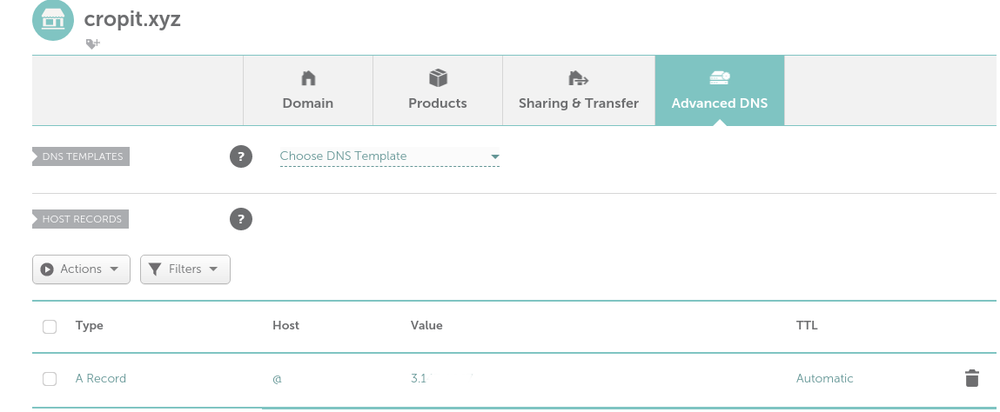
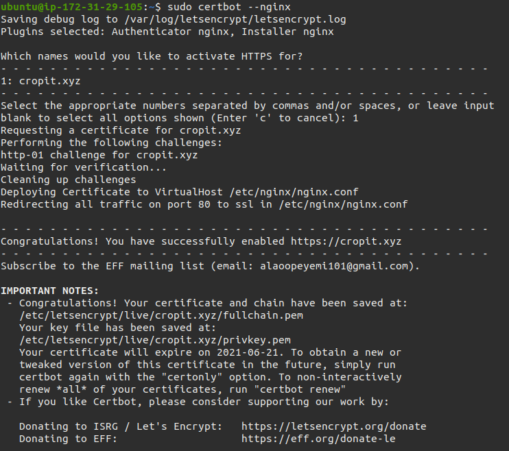
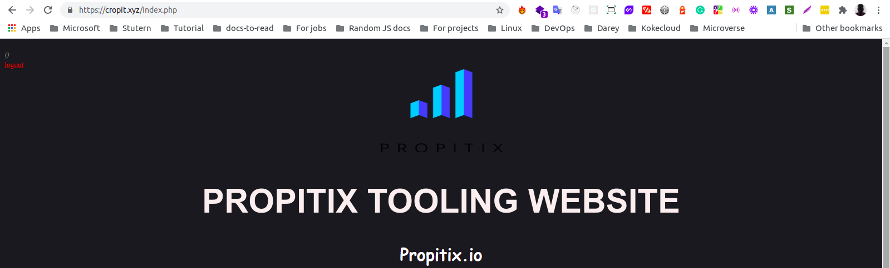
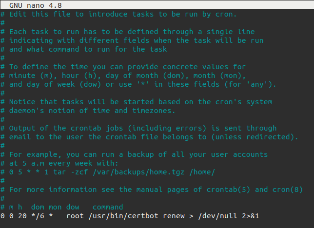

# **Introduction**

### **Title: Load Balancer Solution With Nginx and SSL/TLS Implemetaion**

* This task introduces the implementation load balancing using NGINX web server.
* Having implemented a load balancer on an Apache web server in [Project 8](hhttps://github.com/Eebru-gzy/DevOps-tooling-website/blob/main/proj-8/proj-8.md "Project 8"), I proceeded to use the same EC2 instance to implement NGINX load balancing by purging the instance of the Apache installation and set up.


## **Configure Nginx as a Load Balancer**

* I installed NGINX like so `sudo apt install nginx`.



* I configured the load balancing in the http section of the NGINX config file found at `/etc/nginx/nginx.conf` with the below instructions:

```
upstream myproject {
    server Web1 weight=5;
    server Web2 weight=5;
  }

server {
    listen 80;
    server_name www.domain.com;
    location / {
      proxy_pass http://myproject;
    }
  }
```

* The `web1` and `web2` in the `server` lines in the set up above is local resolution of the web servers private IP addresses to the name, this is found in the `/etc/hosts` file.

* I commented out the line with the instruction `include /etc/nginx/sites-enabled/*` in the NGINX config file.

* I restarted NGINX.



* I opened the HTTPS port of 443 together with the HTTP 80 port already opened in the inbound security group.



## **Registering a Domain Name and Configuring it to Point to the Load Balancer Server**

* I created an elastic IP address and attached it to the Load balancer server, this is to make sure that the public IP address of the server doesn't change every time it is restarted.




* I created a `.xyz` domain name with `namecheap.com`, and updated the A record with the Load Balancer's elastic IP address. 



* I updated the NGINX config file to use the new domain name by replacing the `server_name` value to the domain nmae: `cropit.xyz`.

* After this configuration is saved and syncronized, I could access the LB server through the domain name.


## **Creating a Digital Certificate with LetsEncrypt to Enable SSL/TLS**

* Making use of the LetsEncrypt CLI package `certbot`; I install by running `sudo snap install --classic certbot`

* I initiallized the certificate by running `sudo certbot --nginx` and followed the prompt.



* My tooling website is now visisble on the web browser with an encrypted HTTPS access shown by the padlock in the address bar in the picture below.




* LetsEncrypt's Digital Certificate is usually valid for 90 days, so I created a cronjob `crontab -e` that would renew it few days to the certificate's next expiry date starting from the date `23/03`.




# **The End**