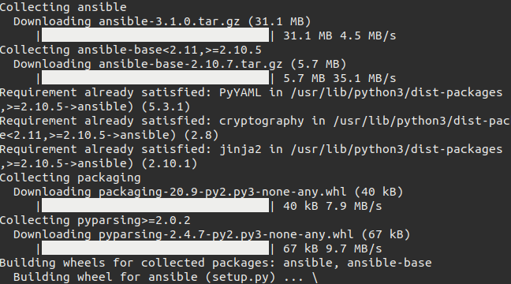
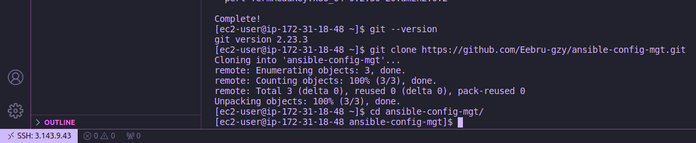
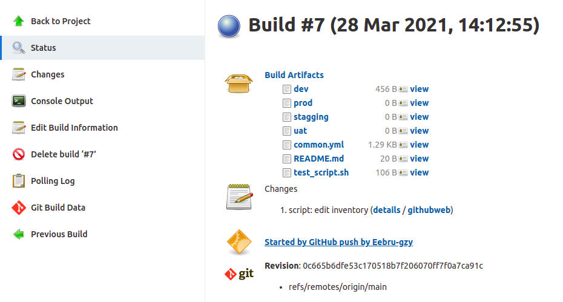
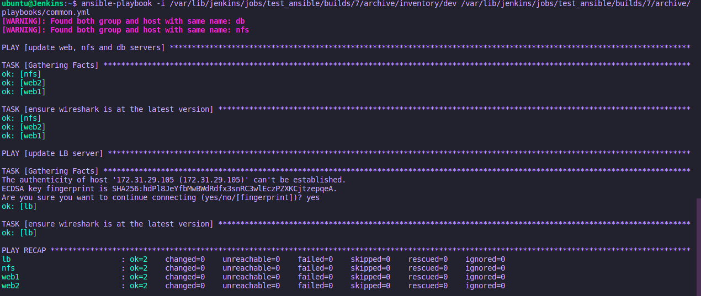
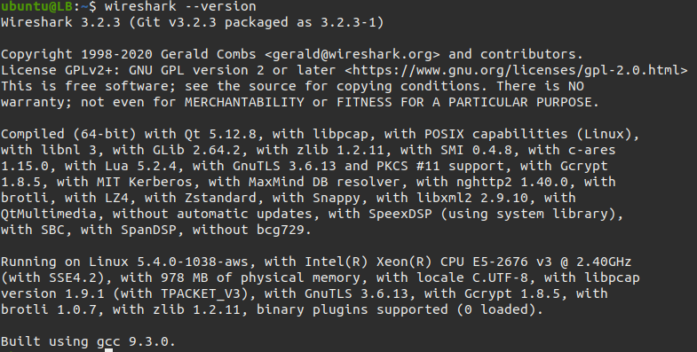

# **Introduction**

## **Title: Automating project 7 to 10 using Ansible and Jenkins**

* This project introduces automating installing packages on all servers using Ansible.

## **Setting up Ansible on EC2**

* I installed Ansible on the Jenkins server running the following codes.

```bash
curl https://bootstrap.pypa.io/get-pip.py -o get-pip.py

sudo python3 get-pip.py

sudo python3 -m pip install ansible
```



* I initiallized a [GitHub repository](https://github.com/Eebru-gzy/ansible-config-mgt "ansible-config-mgt") for the Ansible configuration.

## **Configuring  Jenkins to build the Ansible configuration repository on changes**

* I created a freestyle project on Jenkins, and set a post build to archive all files.

* Jenkins only triggers for main branch on the repository

* I configured a webhook from Github to trigger when it receives changes on main branch

## **Setting up development environment using VSCode**

* I connected VSCode to the server through ssh and cloned the Ansible config repo.



* I created a feature branch and checked out into it.

* I created the necessary the files `dev`, `uat`, `stagging`, `prod` in inventory directory and `common.yml` in playbook directory.

* I populated the inventory file with the servers credentials, and Ansible specific set up, as seen below;

```bash
[nfs]
<NFS-Server-Private-IP-Address> ansible_ssh_user='ec2-user' ansible_ssh_private_key_file=<path-to-.pem-private-key>

[webservers]
<Web-Server1-Private-IP-Address> ansible_ssh_user='ec2-user' ansible_ssh_private_key_file=<path-to-.pem-private-key>
<Web-Server2-Private-IP-Address> ansible_ssh_user='ec2-user' ansible_ssh_private_key_file=<path-to-.pem-private-key>

[db]
<Database-Private-IP-Address> ansible_ssh_user='ec2-user' ansible_ssh_private_key_file=<path-to-.pem-private-key>

[lb]
<Load-Balancer-Private-IP-Address> ansible_ssh_user='ubuntu' ansible_ssh_private_key_file=<path-to-.pem-private-key>
```

* Using `scp` I transfered the ssh key file into the Jenkins server by ruuning `scp -r <file location> <server user>@<server ip>:/<location to put the file>`

## **Populating the playbook file with the plays**

* In the `playbook/common.yml` file, I populated it with the following plays, which is to install a package on the servers

```bash
---
- name: update web, nfs and db servers
  hosts: webservers, nfs
  remote_user: ec2-user
  become: yes
  become_user: root
  tasks:
  - name: ensure wireshark is at the latest version
    yum:
      name: wireshark
      state: latest

- name: update LB server
  hosts: lb
  remote_user: ubuntu
  become: yes
  become_user: root
  tasks:
  - name: ensure wireshark is at the latest version
    apt:
      name: wireshark
      state: latest
```

* I added some other plays to the file.

## **Pushing changes to GitHub and Running the AnsiblePlay**

* I commited and pushed the changes to the repository, after which I made a pull request against the main branch.

* I saw the webhook trigger the build that I setup on Jenkins;



* The artifact of the build is usually found at `/var/lib/jenkins/jobs/ansible/builds/<build_number>/archive/` so I ran the ansible play command like so;

```bash
sudo ansible-playbook -i /var/lib/jenkins/jobs/ansible/builds/<build-number>/archive/inventory/dev.yml /var/lib/jenkins/jobs/ansible/builds/<build-number>/archive/playbooks/common.yml
```



* I checked the servers and found the `wireshark` package installed on all of them.



* I Repeated the processes.

## **The End.**
