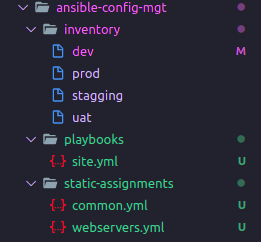
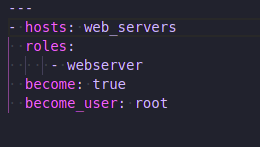
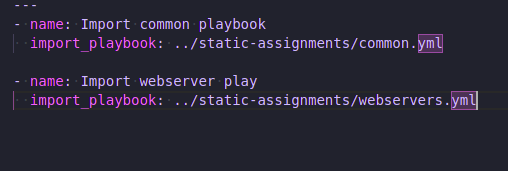

# **Introduction**

## **Title: Ansible Refactoring and Static Assignments (Import)**

* This project is an icing on the project 11; in that, it adds a bit of layer/abstraction on how Asible play was written in the project.

## **Refactor By Importing other playbooks into the Ansible Play entry file**

* The play entry file was changed to `site.yml` in the playbooks directory.

* Another directory `static-assignments` was created and the `common.yml` file was moved in to it.

* `site.yml` now imports the `common.yml` play with the following content:

```yaml
---
hosts: all
- import_playbook: ../static-assignments/common.yml
```

* The directory structure now looks like the picture below.



* I ran the entry `ansible-playbook` command against the `site.yml` entry file.

## **Creating Ansible Role for Configuring WebServers**

* In the parent Ansible directory located in `~/.ansible`, I initialized a role template inside of a `roles` directory, using the `ansible-galazy` CLI utility:

```bash
ansible-galaxy init webserver
```

* From the template bootstrapped by that command, I remove the `test`, `files`, `vars` directories.

* In the `main.yml` located in the task directory, I wrote task to install the `Apache` webserver.

* I also wrote a task in the same file to clone the `tooling` project in the `/var/www/html` folder.

## **Customizing Ansible configuraiton**

* Ansible uses `ansible.cfg` file to to customize its configuration, this file is can be located anywhere, but Ansible must know where it is located.

* I created this file in the `~/.ansible` directory and populated it with the following piece of instructions:

```ini
timeout = 160
roles_path = ~/.ansible/roles
callback_whitelist = profile_tasks
log_path=~/ansible.log
host_key_checking = False
gathering = smart

[ssh_connection]
ssh_args = -o ControlMaster=auto -o ControlPersist=30m -o ControlPath=/tmp/ansible-ssh-%h-%p-%r -o ServerAliveInterval=60 -o ServerAliveCountMax=60
```

* In the above instructon was where Ansible know the path where all roles are located.

* I exported the Ansible config file like so: `export ANSIBLE_CONFIG=~/ansible/ansible.cfg`

## **Importing the Webserver role into the Webserver Playbook**

* In the project directory I created a `webserver.yml` file in the `static-assignment` directory, and imported the `webserver role` like so:



* In the play entry file, I imported the webserver playbook, so the content on the play entry looks like so:



## **The End**
