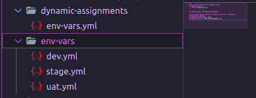
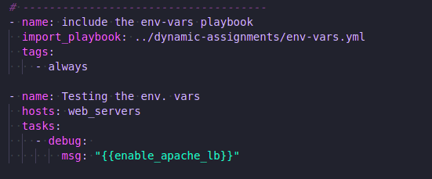
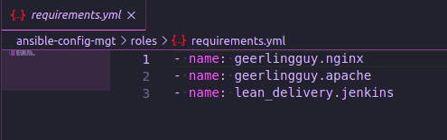
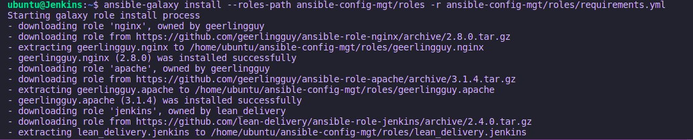
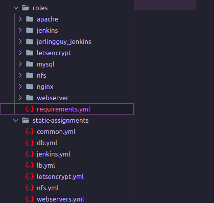
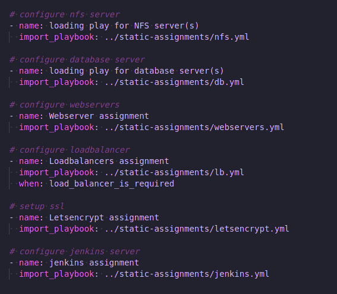
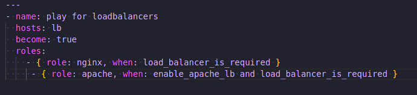

# **Introduction**

## **Title: Implementing Ansible Dynamic Assignments (Include) and Community/Custom Roles**

* Ansible implements functionality to dynamically include various parts of the Ansible playbook tree into an entry playbook file.

* The various parts of the Ansible playbook tree are: `vars`, `tasks`, `play`.

* Dynamic allocation is different from static allocation in that; statically allocated Ansible playbook tree (vars, tasks, play) are pre-loaded before the execution of the play, while dynamic allocation are evaluated and executed while the playbook in which they are allocated is being executed.

* It is recommended to use static assignments for playbooks, because it is more reliable. With dynamic ones, it is hard to debug playbook problems due to its dynamic nature.

## **Including environments variables dynamically**

* To implement dynamic environment variables in my entry playbook file, I created a dynamic directory and an env-vars.yml play file. This play would fetch the environment varibles from each environment's yml files. I populated this file with the content below:

```yaml
- name: collate variables from env specific file, if it exists
  hosts: all
  tasks:
    - name: looping through list of available files
      include_vars: "{{ item }}"
      with_first_found:
        - files:
            - dev.yml
            - stage.yml
            - uat.yml
            - default.yml
          paths:
            - "{{ playbook_dir }}/../env-vars"
      tags:
        - always
```

* I created each environment's file and assigned environment specific variables to them (More on this below).

* The file structure now looks like below:



* I updated the play entry file `site.yml` to include the dynamic allocation of the environment varibles with the following content:

```yml
---
- name: Include dynamic variables 
  hosts: all
  tasks:
    - include_playbook: ../dynamic-assignments/env-vars.yml
  tags:
    - always
```



## **Using Community Roles**

* I created a directory for `roles` in the project root, and exported the path to the `roles` directory by updating the path in the `ansible.cfg` file found in the `linux user home` directory, to inform Ansible where to find the roles.

```bash
export ANSIBLE_CONFIG=../ansible.cfg
```

* I created a requirements file in the roles directory to lists all the roles I intend to download.

* NB: Role names are fetched from `Ansible-galazy`



* Provided the current path on the terminal is the project root, I installed the roles using the command `ansible-galaxy install --roles-path ./roles -r ./roles/requirements`.



* I installed custom roles for some plays as well using `ansible-galaxy init <name of roles>`.

* When I finished configuring roles for different plays for my servers, I have the following directory structure:



* These playbooks in the `static-assignments` are further imported in the entry playbook file.



## **Dynamically using roles on Load Balancer Server**

* Evidently, it is impossible to use both `NGIN-X` and `Apache` for load balancing on the same load balancer server at the same time, so I used environment variables to dynamically use the roles.

* I set variables `enable_nginx_lb`, `load_balancer_is_required` and `enable_apache_lb`, `load_balancer_is_required` to `false` each, in the `default/main.yml` file in nginx and apache roles respectively.

* In the `lb.yml` playbook found in the `static-assignments` directory, I added conditions that allow for any of these roles to get executed based on the environment variable value for `enable_nginx_lb` and `load_balancer_is_required`.



* The values for these environment variables are set in the respective environment files in the `env-vars` directory (pictured above).

* For example, to enable `nginx` in `uat` environment, the variable values in the `uat.yml` would be as seen below.

```yaml
enable_nginx_lb: true
load_balancer_is_required: true
```

* With this, only `nginx` would get installed on the lb server in the `uat` environment.

## **The End**
