# **Introduction**

## **Title: DevOps Tooling Website Solution**

* This task introduces an architecture that requires the use of different servers to achieve different purposes:

  * NFS Server: 1 quantity. The server that hosts the web applications files as well as web logs for share between the web servers.
  * Database Server: 1 quantity. The server that the database would be on.
  * Web Server: 3 quantities. The servers that host the web application.

## **Step 1**

## **Initializing the NFS Server**

* This server serves as the ‘single point of truth’ for the application, all the files and directories that the web-servers would need would be domiciled here.
* I spun up the EC2 instance from AWS and I added 3 block storage volumes of 1GB each to the server.
* I ssh into it.

## **Making Logical Volumes from the Block Storages**

* Using the `MBR's fdisk utility` I created a partition of type LVM (8e) on all the block volumes.
* I made logical volumes for web apps at `/mnt/apps`, web logs at `/mnt/logs` and opt at `/mnt/opt`

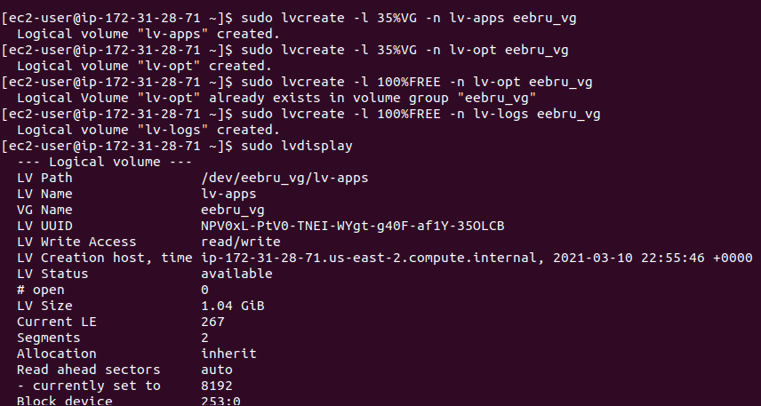

* I also made sure these mount points are always mounting when the system boots by add entry to the `/etc/fstab` file.
* Below is the output of the `mount` command.


## **Installing NFS Server, and configure to start on system boot**

* `sudo yum update` to update the system depenedencies.
* `sudo yum install nfs-utils -y` to install nfs and its dependencies

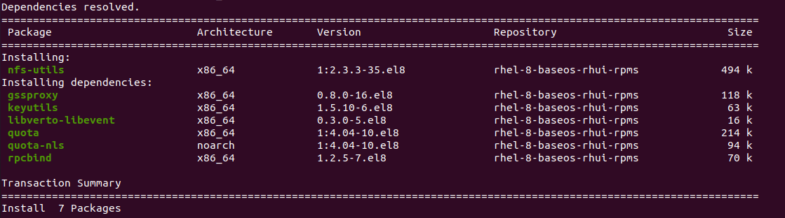

* `sudo systemctl start nfs-server` to start the nfs service
* `sudo systemctl enable nfs-server` to make sure the nfs service starts on boot up
* `sudo systemctl status nfs-server` shows the status of the nfs service running.

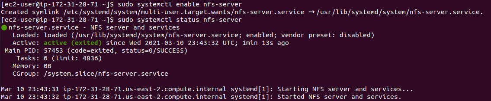

## **Setting permission on the mount points for web servers accessibility**

* Setting the owner of the mount points to nobody so as to accomodate all web servers access:

```bash
sudo chown -R nobody: /mnt/apps
sudo chown -R nobody: /mnt/logs
sudo chown -R nobody: /mnt/opt
```

* Enabling Read, write, execute permissions on the these points:

```bash
sudo chmod -R 777 /mnt/apps
sudo chmod -R 777 /mnt/logs
sudo chmod -R 777 /mnt/opt
```

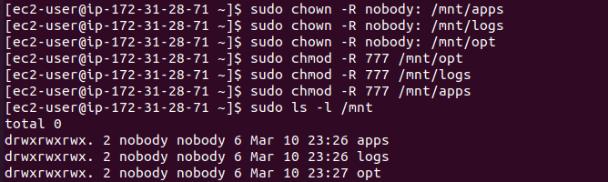

* Restarting the nfs service to synchronize the settings

```bash
sudo systemctl restart nfs-server
```

## **Exporting the mount points**

* At this points, the mount points are all ready for use, but they still aren't available if I do not export them.
* The web apps are going to be created in the same subnet as the NFS server, so I would export the mount points with the IP of the `subnet-CIDR`
* I added entry to the `/etc/exports` file with the following code:

```bash
/mnt/apps <Subnet-CIDR>(rw,sync,no_all_squash,no_root_squash)
/mnt/logs <Subnet-CIDR>(rw,sync,no_all_squash,no_root_squash)
/mnt/opt <Subnet-CIDR>(rw,sync,no_all_squash,no_root_squash)
```

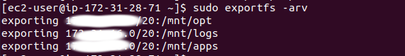

## **Opening NFS port in the NFS EC2 security group**

* At this point mount points are ready for the web servers, but the security group on the EC2 instance still would not allow access into the EC2 instance.
* I checked the the nfs-util port with `rpcinfo -p | grep nfs` to grab the port NFS is running on.
* I added the port to the security inbound on the EC2

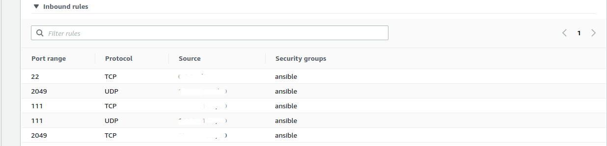

## **Step 2**

## **Installing and setting up database**

* I spun up the EC2 instance.

* I installed MySQL server with `sudo yum install mysql-server`.

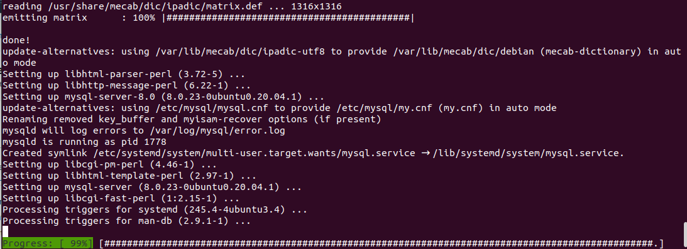

* I created a mysql user with subnet-CIDR host `CREATE USER 'webaccess'@'<subnet-CIDR> IDENTIFIED BY <my pass>;`
* I created a database `CREATE DATABASE tooling;`
* `GRANT ALL PRIVILEGES ON tooling.* TO 'webaccess'@'<subnet-CIDR>';` granted access to the dab user.
* `FLUSH PRIVILEGES;`
* I opend the mysql configuration file at `/etc/mysql/mysql.conf.d/mysqld.cnf` to edit the bind rule to `0.0.0.0` to enable access from hosts other than localhost.
* On the database EC2 instance, I added the inbound rule of `3306` port - port that the web access would be communicating on.

## **Step 3**

## **Initializing and configuring the web-server**

* I spun up an EC2 instance and installed NFS client on it. `sudo yum install nfs-utils nfs4-acl-tools -y`
* `sudo mkdir /var/www` to create directory where the web server would live.
* I mounted the web server directory on the mount point from nfs server  `sudo mount -t nfs -o rw,nosuid <NFS-Server-Private-IP-Address>:/mnt/apps /var/www`

* I installed Apache web server `sudo yum install httpd -y` and started the Apache service.

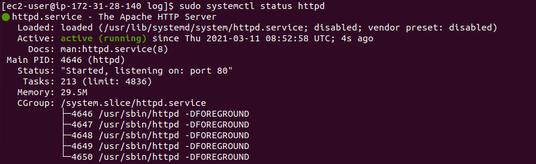

* I backed up the Apache log and error files resident in `/var/log/httpd` in `httpd.back`, then I mounted the nfs log mount point on the httpd log directory with `sudo mount -t nfs -o rw,nosuid <NFS-Server-Private-IP-Address>:/mnt/logs /var/log/httpd` after which I restored the files.

* I added entry to the `/etc/fstab` to allow nfs mount on system boot.

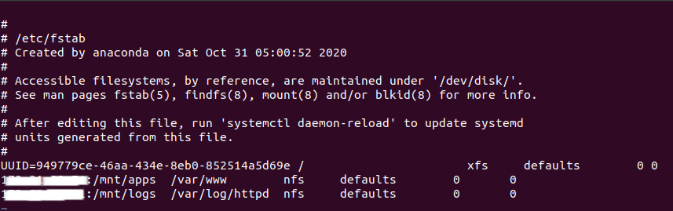

* I installed git and clone the project from the specified repository.

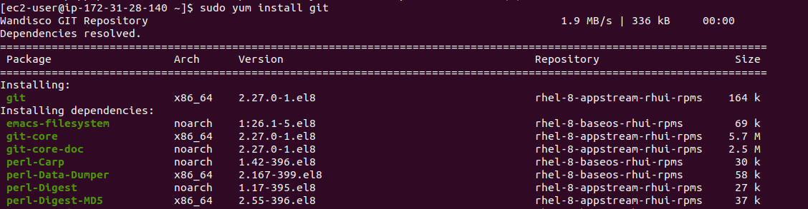

* When I check the nfs server at mount point `/mnt/apps` I found the web server directory `html` there:

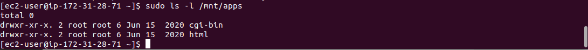

* I opened the inbound port of `80` on EC2 to make access for web browser.

* I ran the command `sudo setenforce 0` to give acces to the browser

* I installed mysql-client on the web server and ran the command to connect to the remote mysql sever on the database server, and also create a record in the tooling database that I already created when I was setting up, the tooling.sql file is a script to create the record: `mysql -u webaccess -h <database server ip> -p tooling < tooling.sql`

* I repeated this processes for the rest web-servers, and they essentially shared web files from the nfs server.

* I accessed the web servers from the browser

### Web 1

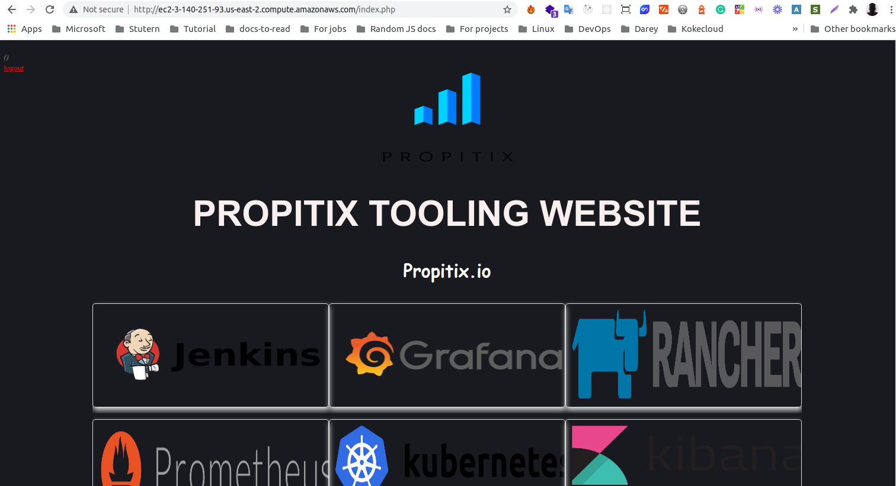

### Web 2

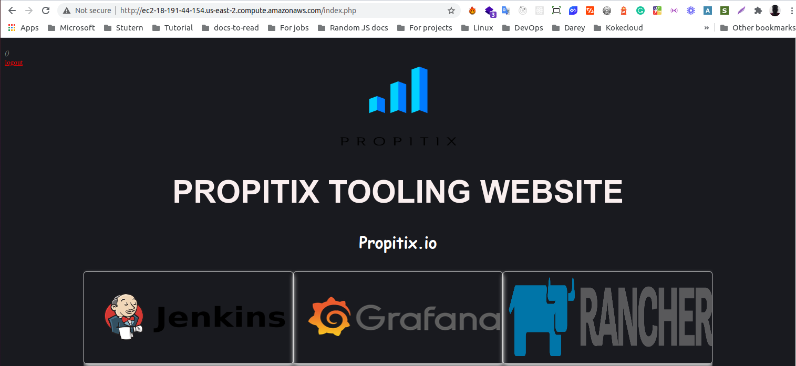

## **The end.**
