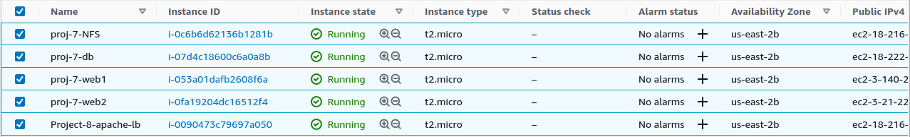

# **Introduction**

* This project is a continuation from `project 7`, where I implemented connections of Web-servers to NFS and database server. This project is to build a Load Balancer on top of the websers to distribute traffic across the web servers.

* As a reminder, below are the listed inventory of types of my servers:
  * NFS Server: RHEL8 (1 qty)
  * Web Server: RHEL8 (2 qty)
  * Database Server: Ubuntu 20.4 (1 qty)

# **Initializing and Configuring Load Balancer Server**

* I spun up an Ubuntu 20.04 machine and SSH into it.

* Below shows the updated servers inventory from AWS.



* I added TCP inbound rule of port 80 for browsers access on the server.

* Beacause the web servers operating on the Web Server machines are Apache web servers, I installed Apache together with its Load balancer on the machine like so:

```
sudo apt install apache2 -y
sudo apt-get install libxml2-dev
```
* I proceeded to activate the modules in Apache that would enable load balancing to work.

``` 
sudo a2enmod rewrite
sudo a2enmod proxy
sudo a2enmod proxy_balancer
sudo a2enmod proxy_http
sudo a2enmod headers
sudo a2enmod lbmethod_bytraffic
``` 
* In the Apache site-available folder, I added the configurations for load balancing like t theo default config file at `/etc/apache2/sites-available/000-default.conf`

```
<Proxy "balancer://mycluster">
  BalancerMember http://<WebServer1-Private-IP-Address>:80 loadfactor=5 timeout=1

  BalancerMember http://<WebServer2-Private-IP-Address>:80 loadfactor=5 timeout=1

  ProxySet lbmethod=bytraffic
  # ProxySet lbmethod=byrequests
</Proxy>

ProxyPreserveHost On
ProxyPass / balancer://mycluster/
ProxyPassReverse / balancer://mycluster/
```

* I restarted the apache service like so: `sudo systemctl restart httpd`


* At this point, the web severs are reachable through the public DNS name of the lb server in the browser.

* In the set up above, it is important to note the means by which we have instructed the Load Balancer to distribute the traffic, which is `bytraffic`, this would make the load balancer share traffic to the webservers based on how it recieves traffic. There are however more means by which the Load Balancer can share traffic:

  * `byrequests`
  * `byheartbeat`
  * `bybusyness`

* Also, the propotion by which the traffic would be distributed is defined in the set up as well.


## **Unmounting the web servers' access and log file**

* In project 7, the web servers' log files were mounted on the NFS server `/mnt/logs`, this is in pursuit to consilidate logs from all web servers to one point of access.

* Unmounting the Apache's web servers log files is necessary to be able to read individual traffic accesses to the web servers from the Load Balancer server.

* I unmounted the log files on both web servers like so: `sudo umount /var/log/htpd` and I also remove their entry from the `/etc/fstab` file.

## Reading the traffics from the Web Servers 
* I ran `sudo tail -f /var/log/httpd/access_log` on each of the web servers, this enabled me to read  new entries into the `access_log` file as they are entering.

* I reloaded the load balancer's public DNS in the browser, and I can see entries in the web servers' log files. This implies that traffic from the load balancer are getting to the web servers.


# **Configuring local DNS Resolution**

* The Domain Name System server is a service that converts (resolution) public IPs of server on the internet to their respective names, it is like a global database of names and IPs of servers on the internet.

* We can also do a DNS resolution locally on our servers, as such we can reference servers by names and not their IPs, I implemented that by editing the `/etc/hosts` file and adding the following to the file:

```
<WebServer1-Private-IP-Address> Web1
<WebServer2-Private-IP-Address> Web2
```

* I edited config for load balancing located at `/etc/apache2/sites-available/000-default.conf` and change the IPs for the servers to their respective names specified in `/etc/hosts`.

```
BalancerMember http://Web1:80 loadfactor=5 timeout=1
BalancerMember http://Web2:80 loadfactor=5 timeout=1
```
* Since this is a local DNS resolution, it can only be accessed on the same machine and not through the internet. 

* I then used `curl` to get the content of the web server pages by running `curl http://web1` and also `curl http://web2`.

* I checked the web servers log files and still found the new request log in them.