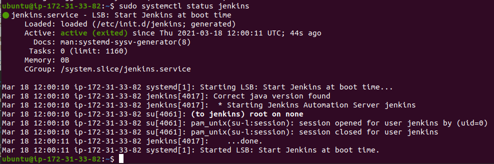
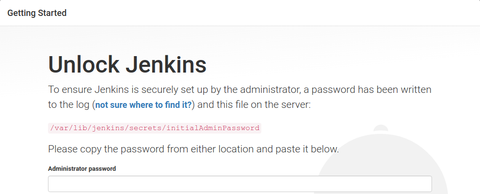
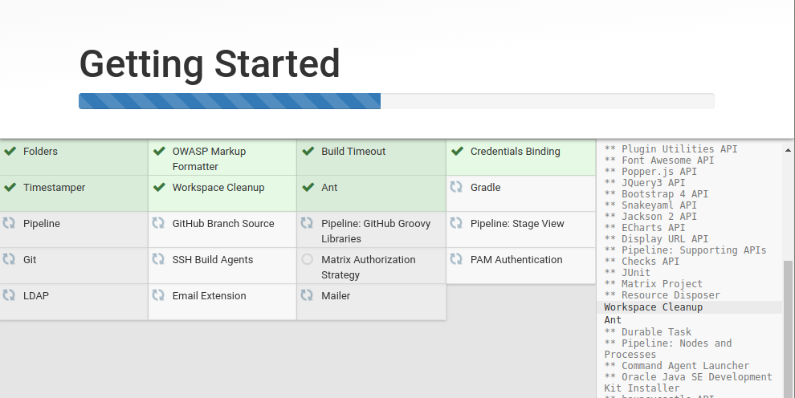
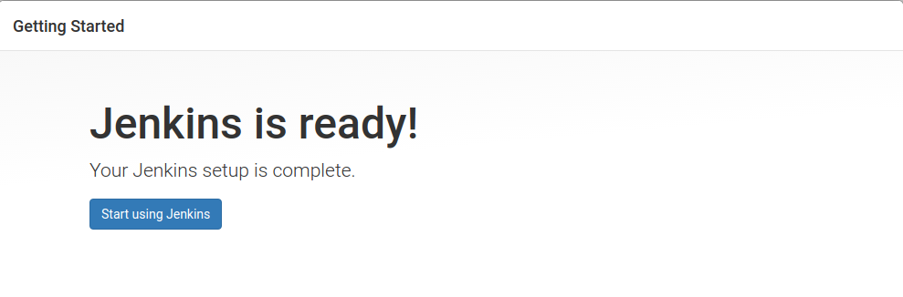
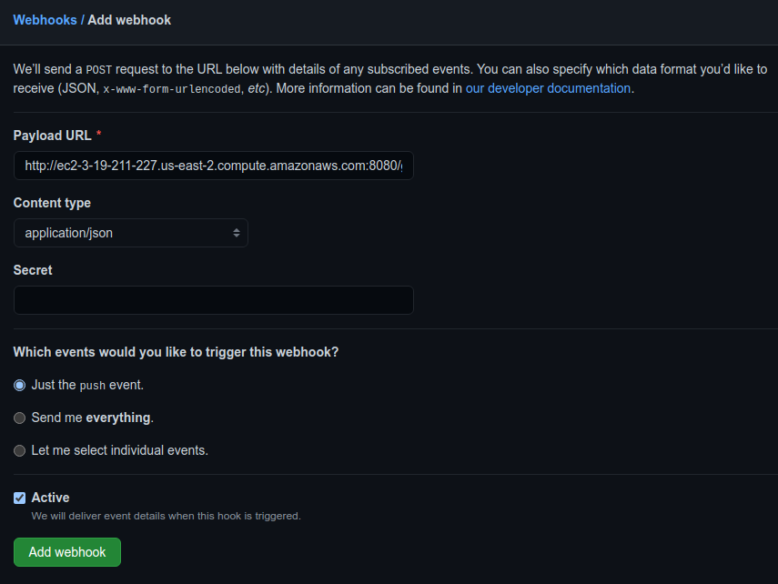
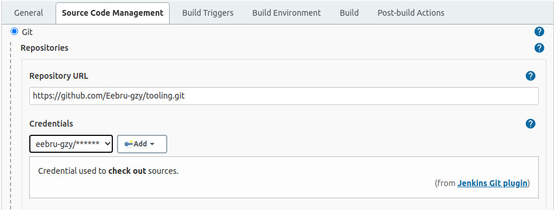
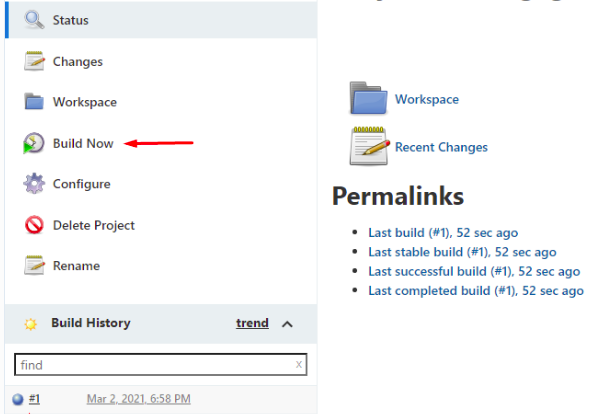
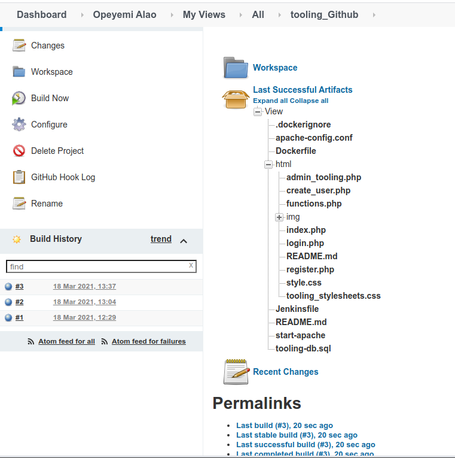
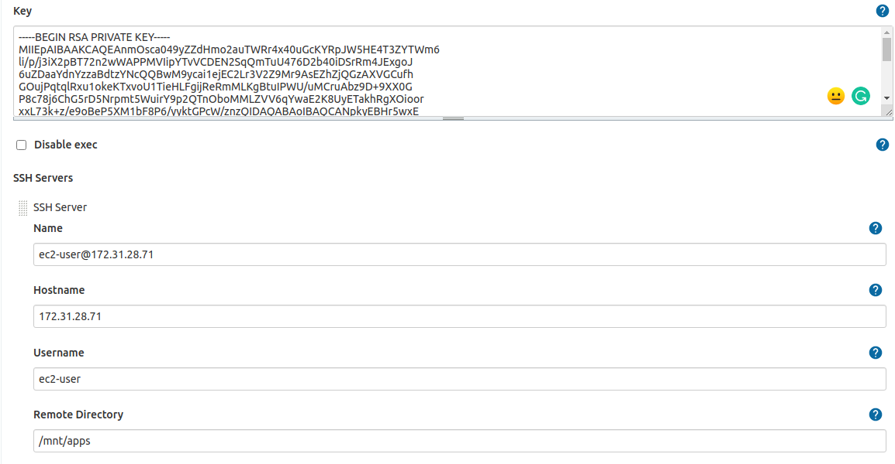
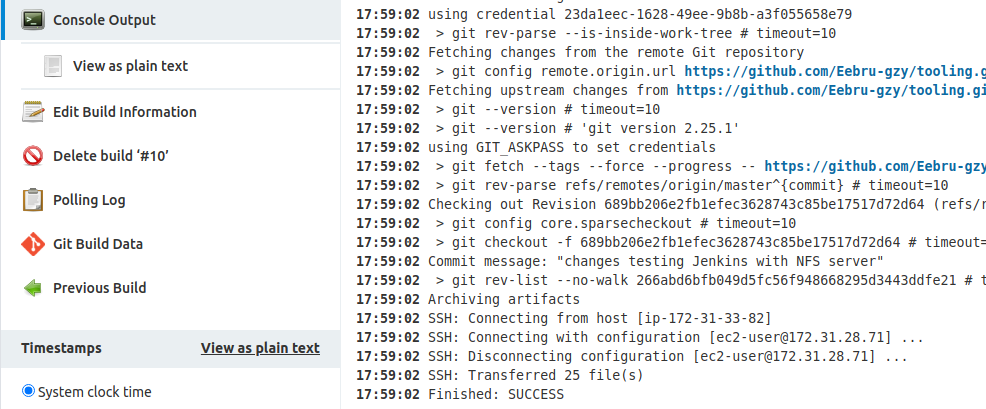

# **Introduction**

### **Title: Tooling Website deployment automation with Continuous Integration. Introduction to Jenkins**

* This project is an introduction to CI - Continous Integration. I implemented CI making use of GitHub Webhook to trigger build on Jenkins server, after which the Jenkins build Artifact then get pushed to the NFS server that is serving the web servers for the DevOps Tooling project that was started from project 7.


## **Spinning up Server and Installing Jenkins**

* I spun up an Ubuntu Focal Fosal machine on AWS.

* Jenkins is Java based, so I installed Java Development Kit as a dependency for it to run.

```
sudo apt install default-jdk-headless
```

* I installed Jenkins running the following commands:

```
wget -q -O - https://pkg.jenkins.io/debian-stable/jenkins.io.key | sudo apt-key add -
sudo sh -c 'echo deb https://pkg.jenkins.io/debian-stable binary/ > /etc/apt/sources.list.d/jenkins.list'
sudo apt update
sudo apt-get install jenkins
```


* Jenkins run on a default port 8080, so I opened the TCP inbound rule of 8080 on AWS security group.

* Jenkins is accessible at `http://<Public-DNS-Name/IP>:8080`

* Jenkins default admin password is found at `/var/lib/jenkins/secrets/initialAdminPassword`, so I copied it to get started.



* After installing necessary plugins, I get started with Jenkins.






## **Configure Jenkins to retrieve source codes from GitHub using Webhooks**

* For Jenkins to receive build from Github source code, I set up the webhook from github. 



* I created a new Freestyle project on Jenkins and configured it with my tooling project GitHub git URl.



* I saved and run the build  by clicking the Build Now link on the Job's screen. 



* However at this point, I am still manually running the build. I set up the Jenkins job to trigger a build when there's a change in the master branch.

* I set up a post build rule to archive all the files from the build.

* To test this, I made some changes to the GitHub repository and I could see the build trigger and the archive after the build.



* The artifact are saved locally at `/var/lib/jenkins/jobs/tooling_github/builds/<build_number>/archive/`


## **Configure Jenkins to copy artifacts over SSH to NFS Server**

* The web server files mount point are located at `/mnt/apps` on the NFS server, I configued the Jenkins servers to push artifacts to the mount point, to do this, I installed the `Publish Over Shh` Jenkins plugin. I also configured the same to talk to the NFS server like so:



* After the set up, I confirmed the setup by testing it, which returned a Success response.

* I configured the Job to publish over SHH in the post build section.

* I changed the ownernship of the `/mnt/app` directory to the user I used in the Jenkins SSH set up. Another work around is to make the jenkins username the name of the owner of the `/mnt/app` directory.

* I made changes in the source code to trigger the build, and see my changes in the NFS server after it has succesfully published over SSH. The logs in the build console is showed below.



* On the NFS server, I cat the `/mnt/apps/README.md` and found the tooling file repository and its changes.


### **The End.**