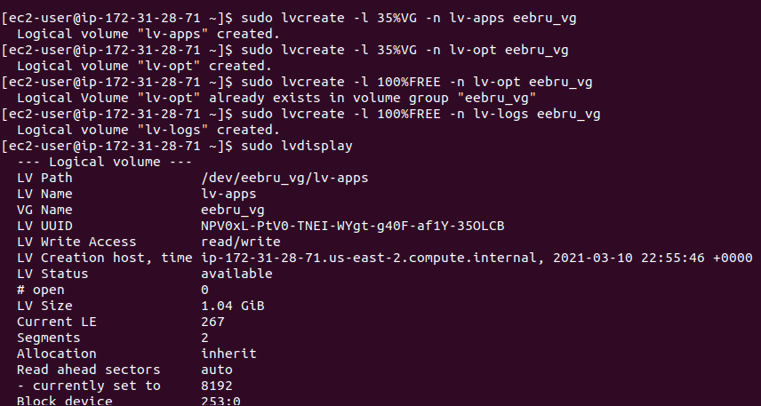
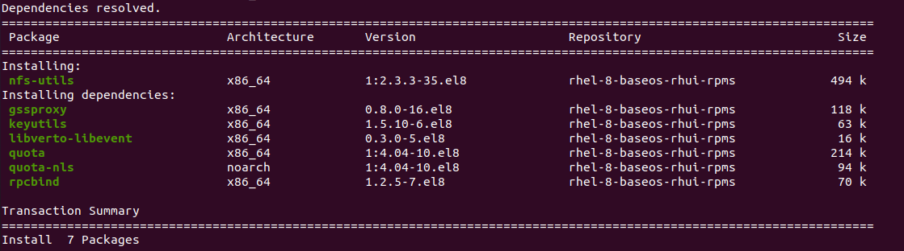
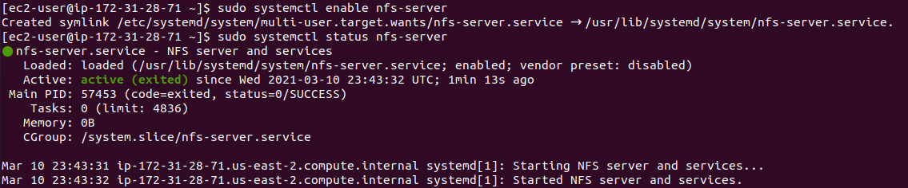
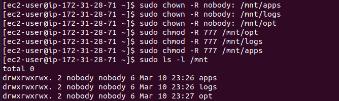
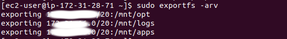
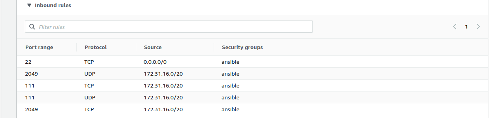

# **Introduction**
* This task introduces an architecture that requires the use of different servers to archive different purposes:

  * NFS Server: 1 quantity. The server that hosts the web applications files as well as web logs.
  * Database Server: 1 quantity. The server that the database would be on.
  * Web Server: 3 quantity. The servers that host the   web application.

# **Step 1**
## **Initializing the NFS Server**
* This server serves as the ‘single point of truth’ for the application, all the files and directories that the web-servers would need would be domiciled here.
* I spun up the EC2 instance from AWS and I added 3 block storage volumes of 1GB each to the server.
* I ssh into it.

## **Making Logical Volumes from the Block Storages**
* Using the `MBR's fdisk utility` I created a partition of type LVM (8e) on all the block volumes.
* I made logical volumes for web apps at `/mnt/apps`, web logs at `/mnt/logs` and opt at `/mnt/opt`


* I also made sure these mount points are always mounting when the system boots by add entry to the `/etc/fstab` file.
* Below is the output of the `mount` command.


## **Installing NFS Server, and configure to start on system boot**
* `sudo yum update` to update the system depenedencies.
* `sudo yum install nfs-utils -y` to install nfs and its dependencies


* `sudo systemctl start nfs-server` to start the nfs service
* `sudo systemctl enable nfs-server` to make sure the nfs service starts on boot up
* `sudo systemctl status nfs-server` shows the status of the nfs service running.



## **Setting permission on the mount points for web servers accessibility**

* Setting the owner of the mount points to nobody so as to accomodate all web servers access:

```
sudo chown -R nobody: /mnt/apps
sudo chown -R nobody: /mnt/logs
sudo chown -R nobody: /mnt/opt
```
* Enabling Read write execute on the these points:
```
sudo chmod -R 777 /mnt/apps
sudo chmod -R 777 /mnt/logs
sudo chmod -R 777 /mnt/opt
```

* Restarting the nfs service to synchronize the settings
```
sudo systemctl restart nfs-server
```
##  **Exporting the mount points** 

* At this points, the mount points are all ready for use, but they still aren't available if I do not export them.
* The web apps are going to be created in the same subnet as the NFS server, so I would export the mount points with the IP of the `subnet-CIDR`
* I added entry to the `/etc/exports` file with the following code:
```
/mnt/apps <Subnet-CIDR>(rw,sync,no_all_squash,no_root_squash)
/mnt/logs <Subnet-CIDR>(rw,sync,no_all_squash,no_root_squash)
/mnt/opt <Subnet-CIDR>(rw,sync,no_all_squash,no_root_squash)
```


## **Opening NFS port in the NFS EC2 security group**
* At this point mount points are aready for the web servers, but the security group on the EC2 instance still would not allow access into the EC2 instance.
* I checked the the nfs-util port with `rpcinfo -p | grep nfs` to grab the port NFS is running on.
* I added the port to the security inbound on the EC2



# **Step 2**

